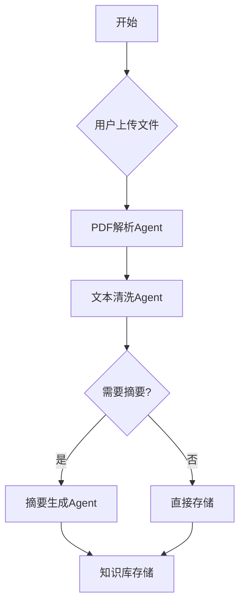
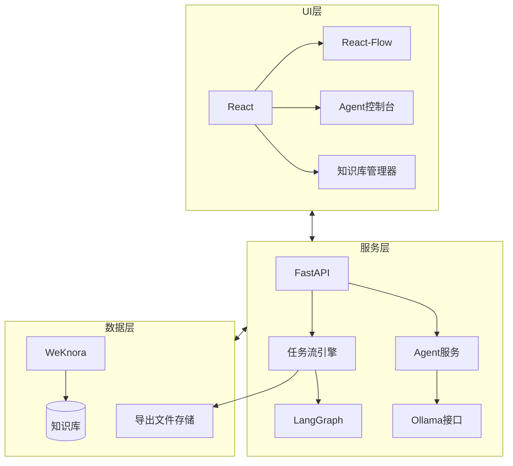

# 个人Agent助手平台PRD（最终版）

## 一、产品概述
### 1.1 产品愿景
打造**完全本地化部署**的个人Agent助手平台，让用户通过自然语言创建、编排和调试AI Agent，并集成私有化知识库管理能力，实现**数据100%私有、流程完全可控**的智能自动化助手。

### 1.2 核心价值
- **零编码创建Agent**：自然语言描述即可生成专业Agent
- **可视化任务编排**：拖拽式构建复杂工作流
- **无缝调试体验**：本地LangStudio深度集成
- **知识资产私有化**：WeKnora知识库安全存储

### 1.3 版本规划
| 版本 | 核心功能 | 技术栈 | 交付周期 |
|------|----------|--------|----------|
| **MVP v0.1** | 基础单Agent创建与执行 | LangChain + Ollama | 2周 |
| **v0.2**     | LangGraph任务流编排 | React Flow + LangGraph | 3周 |
| **v0.3**     | LangStudio调试导出 | 自定义导出器 | 2周 |
| **v0.4**     | WeKnora知识库集成 | WeKnora REST API | 3周 |

---

## 二、详细功能需求

### 2.1 MVP v0.1：个人Agent助手（核心）
**功能描述**：
- 用户通过自然语言创建单Agent（如："创建PDF总结Agent"）
- 基础Agent调试控制台（输入/输出/日志）
- 预置Agent模板库（总结/分类/问答等）

**技术实现**：
```python
# Agent创建核心逻辑
def create_agent_from_nl(description):
    # 1. 自然语言解析
    prompt = f"""
    用户需求：{description}
    请生成JSON配置：
    {{
      "name": "Agent名称",
      "role": "角色描述",
      "tools": ["工具列表"],
      "prompt_template": "模板内容"
    }}
    """
    
    # 2. 调用本地Ollama模型
    response = ollama.generate(model="llama3", prompt=prompt)
    
    # 3. 创建可执行Agent
    return langchain.initialize_agent(
        tools=parse_tools(response.tools),
        llm=local_llm,
        prompt=response.prompt_template
    )
```

**验收标准**：
- 输入5条自然语言指令，成功创建并运行3个以上Agent
- Agent平均响应时间≤5秒（基于Ollama）

---

### 2.2 v0.2：LangGraph任务流编排
**功能描述**：
- 可视化DAG编辑器（拖拽节点/连线）
- 支持三种流程结构：
  - 顺序执行
  - 条件分支（if/else）
  - 并行执行
- 节点类型：
  - Agent节点
  - 输入/输出节点
  - 条件判断节点

**技术实现**：


**验收标准**：
- 可构建5节点以上的复杂工作流
- 支持并行执行2个以上Agent

---

### 2.3 v0.3：LangStudio调试导出
**功能描述**：
- 导出工作流为LangStudio兼容格式
- 包含完整调试信息：
  - Agent配置快照
  - 节点依赖关系
  - 历史执行数据
- 支持双向同步：
  - 导出 → LangStudio调试
  - 导入LangStudio修改 → 更新本地流程

**导出文件格式**：
```json
{
  "format_version": "0.3",
  "workflow_name": "文档处理流水线",
  "created_at": "2025-10-01T12:00:00Z",
  "nodes": [
    {
      "id": "node-1",
      "type": "agent",
      "config": {
        "name": "PDF解析Agent",
        "prompt": "...",
        "tools": ["PyPDF2"]
      }
    },
    {
      "id": "node-2",
      "type": "condition",
      "expression": "input.pages > 5"
    }
  ],
  "edges": [
    {
      "source": "node-1",
      "target": "node-2"
    }
  ]
}
```

**验收标准**：
- 导出的JSON文件可被LangStudio v0.8+加载
- 调试信息完整度≥90%

---

### 2.4 v0.4：WeKnora知识库集成
**功能描述**：
1. **知识库管理**：
   - 文档上传/分类/检索
   - 标签系统
   - 版本历史
   
2. **知识处理流水线**：
   ```mermaid
   sequenceDiagram
       participant U as 用户
       participant A as 上传Agent
       participant B as 清洗Agent
       participant C as 摘要Agent
       participant W as WeKnora
       
       U->>A: 上传文档
       A->>B: 原始文本
       B->>C: 清洗后文本
       C->>W: 摘要+元数据
       W-->>U: 存储成功通知
   ```

3. **API集成点**：
   | 功能 | WeKnora API | 请求示例 |
   |------|-------------|----------|
   | 文档上传 | POST /api/v1/upload | `{file: <binary>, tags: ["research"]}` |
   | 文档检索 | POST /api/v1/query | `{query: "LangChain原理", max_results: 5}` |

**验收标准**：
- 文档处理流水线成功率≥95%
- 检索响应时间≤3秒（万级文档库）

---

## 三、系统架构


---

## 四、非功能需求
1. **性能指标**：
   - 单Agent响应：≤5秒
   - 工作流导出：≤2秒
   - 知识检索：≤3秒

2. **安全要求**：
   - 所有数据本地存储
   - 通信加密（HTTPS/WSS）
   - 用户认证（JWT）

3. **兼容性**：
   - LangStudio ≥0.8
   - WeKnora ≥0.5.3
   - Ollama ≥0.6

---

## 五、交付计划
| 阶段 | 里程碑 | 交付物 | 时间 |
|------|--------|--------|------|
| 启动 | 架构设计完成 | 技术架构文档 | 第1周 |
| MVP v0.1 | 单Agent运行 | Agent创建引擎+基础UI | 第3周 |
| v0.2 | 任务流上线 | 可视化编辑器+执行引擎 | 第6周 |
| v0.3 | 调试导出 | LangStudio导出器 | 第8周 |
| v0.4 | 知识库集成 | WeKnora对接模块 | 第11周 |
| 发布 | 正式版上线 | 完整系统+文档 | 第12周 |

---

## 六、风险与应对
| 风险 | 等级 | 应对方案 |
|------|------|----------|
| Ollama性能不足 | 高 | 1. 支持多模型切换<br>2. 提供性能预警 |
| LangStudio兼容性问题 | 中 | 1. 版本锁定<br>2. 兼容性测试套件 |
| 复杂流程调试困难 | 中 | 1. 分阶段执行<br>2. 节点检查点 |
| 知识库处理失败 | 低 | 1. 重试机制<br>2. 错误隔离 |

---
