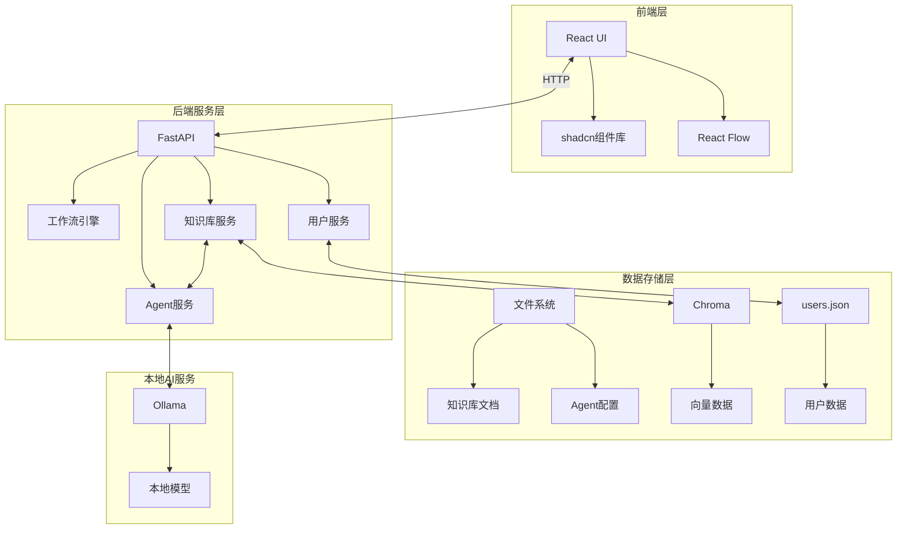
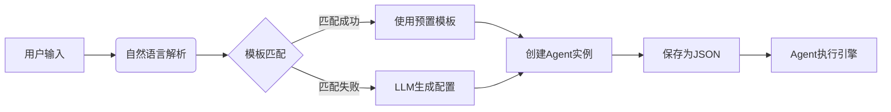
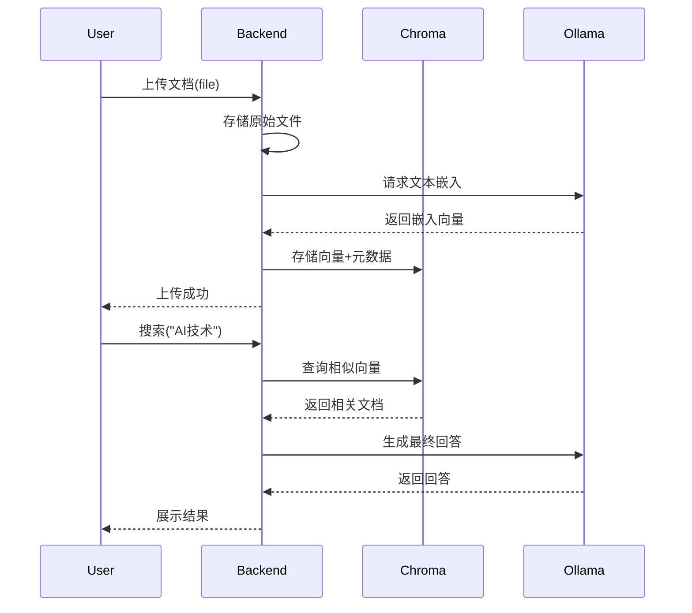
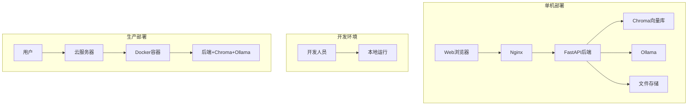
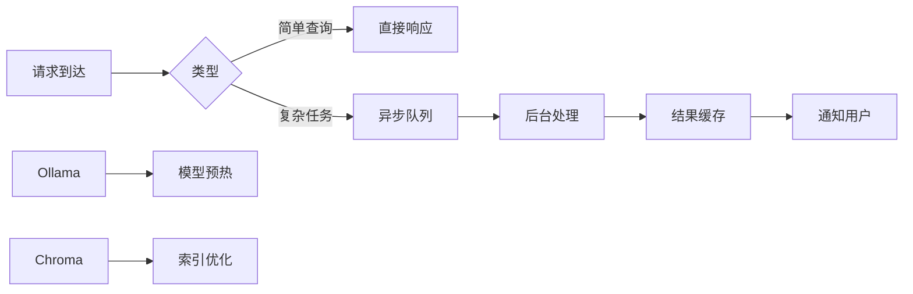

# 个人Agent助手平台 - 最终技术架构文档

## 一、系统架构概览



## 二、技术栈说明

### 1. 前端技术栈
| 组件 | 技术选型 | 用途说明 |
|------|----------|----------|
| **框架** | React 18 | 构建用户界面 |
| **UI库** | shadcn/ui | 基于Tailwind的高质量组件 |
| **状态管理** | Zustand | 轻量级状态管理 |
| **工作流可视化** | React Flow | DAG工作流编辑 |
| **HTTP客户端** | Axios | REST API通信 |
| **文件上传** | react-dropzone | 文件拖拽上传 |

### 2. 后端技术栈
| 组件 | 技术选型 | 用途说明 |
|------|----------|----------|
| **框架** | FastAPI | 高性能API服务 |
| **异步处理** | asyncio | 异步任务处理 |
| **AI框架** | LangChain | Agent核心框架 |
| **工作流引擎** | LangGraph | 任务流编排 |
| **向量数据库** | Chroma | 本地向量存储 |
| **文件管理** | aiofiles | 异步文件操作 |

### 3. 数据存储方案
| 数据类型 | 存储方式 | 说明 |
|----------|----------|------|
| **用户数据** | users.json | 邮箱、密码哈希等 |
| **Agent配置** | agent_configs/ | JSON文件存储 |
| **知识库文档** | knowledge_base/ | 原始文件存储 |
| **向量数据** | Chroma本地存储 | 嵌入向量 |
| **工作流配置** | workflows/ | JSON文件存储 |

## 三、核心模块设计

### 1. 用户管理模块
```python
# 用户数据结构
{
    "email": "user@example.com",
    "password_hash": "scrypt$...",  # 使用scrypt哈希
    "created_at": "2023-10-01T12:00:00Z",
    "last_login": "2023-10-05T14:30:00Z"
}

# 用户服务接口
class UserService:
    def register(email: str, password: str) -> bool:
        """注册新用户，密码哈希后存储"""
    
    def login(email: str, password: str) -> bool:
        """验证用户凭据"""
    
    def change_password(email: str, old_password: str, new_password: str) -> bool:
        """修改密码"""
```

### 2. Agent管理模块


Agent配置示例 (`/data/agents/summary_agent.json`):
```json
{
  "id": "agent_001",
  "name": "PDF摘要生成器",
  "description": "自动提取PDF文档核心内容",
  "created_at": "2023-10-05",
  "tools": ["PyPDF2", "NLTK"],
  "prompt_template": "你是一个专业的内容摘要专家...",
  "owner": "user@example.com"
}
```

### 3. 工作流引擎模块
```python
class WorkflowEngine:
    def create_workflow(name: str, nodes: list, edges: list) -> str:
        """创建工作流并保存为JSON"""
    
    def execute_workflow(workflow_id: str, input_data: dict) -> dict:
        """执行工作流"""
    
    def export_to_langstudio(workflow_id: str) -> dict:
        """导出为LangStudio兼容格式"""

# 工作流存储路径: /data/workflows/{workflow_id}.json
```

### 4. 知识库集成模块


## 四、文件系统目录结构

```
/agent-platform
│
├── frontend/               # 前端代码
│   ├── public/             # 静态资源
│   └── src/
│       ├── components/     # 组件
│       ├── pages/         # 页面
│       │   ├── AgentFactory.js
│       │   ├── WorkflowEditor.js
│       │   └── KnowledgeBase.js
│       └── App.js
│
├── backend/                # 后端代码
│   ├── main.py             # FastAPI入口
│   ├── services/
│   │   ├── agent_service.py
│   │   ├── workflow_service.py
│   │   ├── knowledge_service.py
│   │   └── user_service.py
│   │
│   └── data/               # 数据存储
│       ├── users.json      # 用户凭据
│       ├── agents/         # Agent配置
│       ├── workflows/      # 工作流配置
│       └── knowledge_base/ # 原始文档
│           ├── user1/
│           └── user2/
│
├── chroma-data/            # Chroma向量存储
│   ├── index
│   └── collections
│
└── docker-compose.yml      # 容器配置
```

## 五、关键接口设计

### 1. Agent管理接口
| 端点 | 方法 | 说明 |
|------|------|------|
| `/api/agents` | POST | 创建新Agent |
| `/api/agents/{id}` | GET | 获取Agent详情 |
| `/api/agents/{id}/execute` | POST | 执行Agent |
| `/api/agents/{id}` | DELETE | 删除Agent |

### 2. 工作流管理接口
| 端点 | 方法 | 说明 |
|------|------|------|
| `/api/workflows` | POST | 创建工作流 |
| `/api/workflows/{id}/execute` | POST | 执行工作流 |
| `/api/workflows/{id}/export` | GET | 导出为LangStudio格式 |
| `/api/workflows/{id}` | DELETE | 删除工作流 |

### 3. 知识库管理接口
| 端点 | 方法 | 说明 |
|------|------|------|
| `/api/knowledge/upload` | POST | 上传文档 |
| `/api/knowledge/search` | POST | 文档搜索 |
| `/api/knowledge/{doc_id}` | DELETE | 删除文档 |

### 4. 用户管理接口
| 端点 | 方法 | 说明 |
|------|------|------|
| `/api/auth/register` | POST | 用户注册 |
| `/api/auth/login` | POST | 用户登录 |
| `/api/auth/change-password` | POST | 修改密码 |

## 六、部署架构



### 容器化部署配置
```yaml
version: '3.8'

services:
  backend:
    build: ./backend
    ports:
      - "8000:8000"
    volumes:
      - ./backend/data:/app/data
      - ./chroma-data:/chroma-data
    environment:
      CHROMA_PATH: "/chroma-data"
      OLLAMA_HOST: "host.docker.internal:11434"
    
  ollama:
    image: ollama/ollama
    ports:
      - "11434:11434"
    volumes:
      - ollama-data:/root/.ollama

volumes:
  ollama-data:
```

## 七、安全与性能

### 1. 安全措施
- **密码存储**：使用scrypt算法哈希
- **文件隔离**：用户数据目录隔离
- **输入验证**：严格验证所有API输入
- **访问控制**：基于所有者的资源访问

### 2. 性能优化


## 八、演进路线

### 1. MVP阶段 (v0.1)
```mermaid
gantt
    title MVP开发计划
    dateFormat  YYYY-MM-DD
    section 核心功能
    用户系统       ：a1, 2023-10-10, 5d
    Agent创建     ：a2, after a1, 7d
    基本执行引擎   ：a3, after a2, 5d
    
    section 基础设施
    目录结构搭建   ：b1, 2023-10-10, 3d
    Chroma集成    ：b2, after b1, 5d
```

### 2. 后续阶段
| 版本 | 功能 | 依赖 |
|------|------|------|
| v0.2 | 工作流编排 | React Flow集成 |
| v0.3 | LangStudio导出 | LangGraph兼容性 |
| v0.4 | 知识库增强 | 文档处理流水线 |

