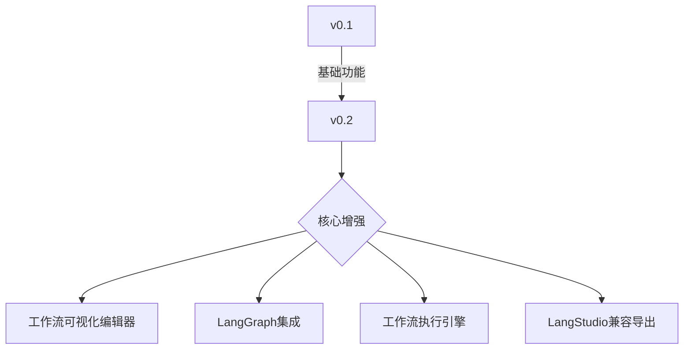
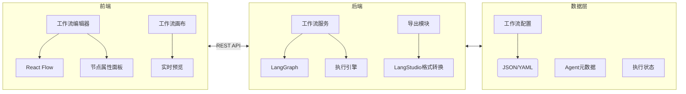
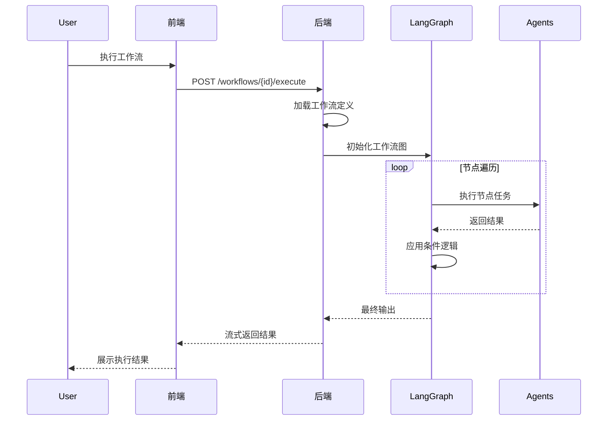
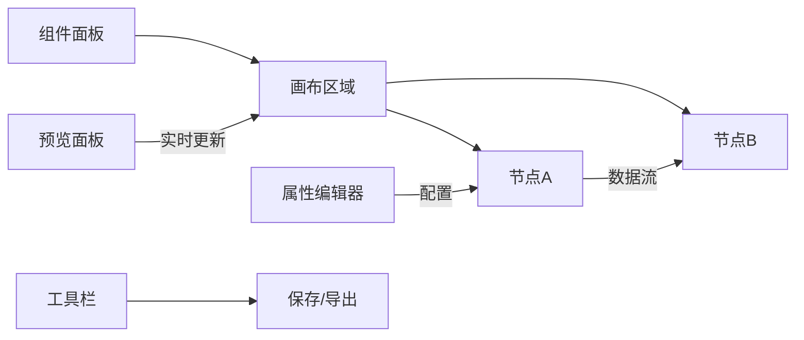
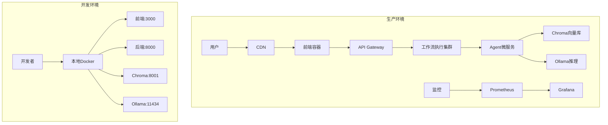

# WeKnora Agent 平台 v0.2 技术架构文档

## 一、版本目标
v0.2 版本聚焦于**工作流编排功能**的实现，让用户能够：
1. 可视化创建复杂任务处理流程
2. 将多个Agent组合成自动化工作流
3. 导出工作流到LangStudio兼容格式
4. 实现跨Agent的数据传递



## 二、架构升级概览

### 整体架构图


### 技术栈增强

| 模块 | 新增技术 | 作用 |
|------|----------|------|
| **前端** | React Flow v11 | 可视化工作流编辑 |
|  | Zustand v4 | 复杂状态管理 |
|  | Monaco Editor | 工作流配置编辑 |
| **后端** | LangGraph v0.1 | 工作流执行引擎 |
|  | Pydantic v2 | 工作流模型验证 |
|  | AsyncIO | 并发工作流执行 |
| **数据** | YAML | 工作流定义文件 |

## 三、工作流核心设计

### 1. 工作流模型
```python
class WorkflowNode(BaseModel):
    id: UUID
    type: Literal["agent", "tool", "condition", "input", "output"]
    position: Tuple[float, float]
    data: Union[AgentConfig, ToolConfig, ConditionConfig]
    
class WorkflowEdge(BaseModel):
    id: UUID
    source: UUID
    target: UUID
    label: Optional[str] = None  # 条件分支标识

class WorkflowDefinition(BaseModel):
    id: UUID
    name: str
    description: str
    nodes: List[WorkflowNode]
    edges: List[WorkflowEdge]
    created_at: datetime
    updated_at: datetime
```

### 2. 工作流执行引擎


### 3. LangGraph集成
```python
from langgraph.graph import StateGraph

class WorkflowState(TypedDict):
    input: str
    intermediate_results: dict
    final_output: Optional[str]

def create_workflow_graph(definition: WorkflowDefinition):
    builder = StateGraph(WorkflowState)
    
    # 添加节点
    for node in definition.nodes:
        builder.add_node(node.id, node_executor(node))
    
    # 添加边
    for edge in definition.edges:
        if edge.label:
            builder.add_conditional_edges(
                edge.source,
                lambda state: edge.label,
                {edge.label: edge.target}
            )
        else:
            builder.add_edge(edge.source, edge.target)
    
    # 设置入口和出口
    builder.set_entry_point(definition.entry_node)
    builder.set_finish_point(definition.exit_node)
    
    return builder.compile()
```

## 四、目录结构升级

```
/agent-platform
├── frontend/
│   └── src/
│       ├── features/
│       │   └── workflow-editor/   # 新增工作流编辑器功能
│       │       ├── FlowCanvas.js
│       │       ├── NodePalette.js
│       │       ├── NodeProperties.js
│       │       └── WorkflowPreview.js
│       └── stores/
│           └── workflowStore.js    # Zustand状态管理
│
├── backend/
│   ├── services/
│   │   └── workflow_service.py    # 新增工作流服务
│   ├── core/
│   │   ├── workflow_engine.py     # 工作流执行引擎
│   │   └── langgraph_adapter.py   # LangGraph集成
│   └── data/
│       └── workflows/             # 工作流存储目录
│           ├── user1/
│           │   ├── doc-process.yaml
│           │   └── research-flow.json
│           └── user2/
│               └── sales-automation.yaml
│
└── docs/
    └── workflow-spec.md           # 工作流定义规范
```

## 五、接口扩展设计

### 1. 工作流管理接口
| 端点 | 方法 | 请求体 | 响应 | 说明 |
|------|------|--------|------|------|
| `/api/workflows` | POST | WorkflowDefinition | { id } | 创建工作流 |
| `/api/workflows/{id}` | PUT | WorkflowDefinition | 200 | 更新工作流 |
| `/api/workflows/{id}/export` | GET | - | LangStudio JSON | 导出工作流 |
| `/api/workflows/preview` | POST | WorkflowDefinition | 执行预览 | 工作流预执行 |

### 2. 工作流执行接口
```python
@app.post("/workflows/{workflow_id}/execute")
async def execute_workflow(
    workflow_id: str,
    inputs: dict,
    stream: bool = False
):
    """
    执行工作流
    - stream=true时启用Server-Sent Events流式响应
    """
    workflow = load_workflow(workflow_id)
    graph = create_workflow_graph(workflow)
    
    if stream:
        return StreamingResponse(
            execute_streaming(graph, inputs),
            media_type="text/event-stream"
        )
    else:
        return execute_sync(graph, inputs)
```

## 六、工作流编辑器设计

### 功能特性
1. **可视化画布**：拖拽式节点布局
2. **节点库**：
   - Agent节点（预置用户Agent）
   - 工具节点（API调用、数据处理）
   - 条件节点（if/else分支）
   - 输入/输出节点
3. **实时预览**：模拟数据流经工作流
4. **版本历史**：工作流变更追踪



## 七、LangStudio兼容性

### 导出格式规范
```json
{
  "name": "Research Workflow",
  "description": "自动研究分析流程",
  "nodes": [
    {
      "id": "node1",
      "type": "agent",
      "config": {
        "agent_id": "web-researcher",
        "parameters": {
          "query": "{{input.topic}}"
        }
      }
    },
    {
      "id": "node2",
      "type": "agent",
      "config": {
        "agent_id": "report-generator",
        "parameters": {
          "data": "{{node1.output}}"
        }
      }
    }
  ],
  "connections": [
    {
      "source": "node1",
      "target": "node2"
    }
  ]
}
```

### 转换服务
```python
def convert_to_langstudio(workflow: WorkflowDefinition):
    langstudio_format = {
        "name": workflow.name,
        "description": workflow.description,
        "nodes": [],
        "connections": []
    }
    
    for node in workflow.nodes:
        langstudio_node = {
            "id": str(node.id),
            "type": node.type,
            "config": node.data.to_langstudio()
        }
        langstudio_format["nodes"].append(langstudio_node)
    
    for edge in workflow.edges:
        langstudio_format["connections"].append({
            "source": str(edge.source),
            "target": str(edge.target)
        })
    
    return langstudio_format
```

## 八、性能与优化

### 执行优化策略
1. **并行执行**：对无依赖节点启用并行处理
```python
async def execute_parallel(nodes, state):
    tasks = [node_executor(node, state) for node in nodes]
    return await asyncio.gather(*tasks)
```

2. **缓存机制**：相同输入跳过重复计算
3. **资源限制**：工作流最大深度限制（20层）
4. **超时控制**：节点级别超时设置（默认30秒）

### 监控指标


## 九、安全增强

1. **工作流沙箱**：
   ```python
   @sandboxed_execution
   def unsafe_node_execution(code):
       # 在受限环境中执行
       ...
   ```

2. **节点权限控制**：
   - 用户只能使用自己创建的Agent节点
   - 工具节点白名单机制

3. **输入净化**：
   ```python
   clean_input = sanitize_user_input(raw_input)
   ```

## 十、部署架构



### 容器编排
```yaml
services:
  workflow-worker:
    image: workflow-executor:v0.2
    environment:
      MAX_CONCURRENT_WORKFLOWS: 10
      EXECUTION_TIMEOUT: 300
    depends_on:
      - agent-service
      - chroma

  agent-service:
    image: agent-service:v0.2
    volumes:
      - ./agents:/data/agents
```

## 十一、演进路线

```mermaid
gantt
    title v0.2开发里程碑
    dateFormat  YYYY-MM-DD
    section 核心功能
    工作流编辑器前端  ：active,  des1, 2023-10-10, 7d
    LangGraph集成    ：         des2, after des1, 5d
    执行引擎        ：         des3, after des2, 7d
    LangStudio导出  ：         des4, after des3, 3d
    
    section 质量保障
    压力测试        ：         des5, after des4, 5d
    安全审计        ：         des6, after des5, 4d
    用户体验优化    ：         des7, after des6, 5d
```

## 十二、文档产出

1. **工作流创建指南**：包含示例工作流
2. **API参考手册**：工作流相关端点文档
3. **LangStudio迁移指南**：兼容性说明
4. **性能调优手册**：大型工作流优化建议

v0.2版本通过引入可视化工作流编排，将平台能力从单个Agent执行扩展到复杂任务自动化，同时保持与LangChain生态的兼容性，为用户提供更强大的AI助手构建体验。
